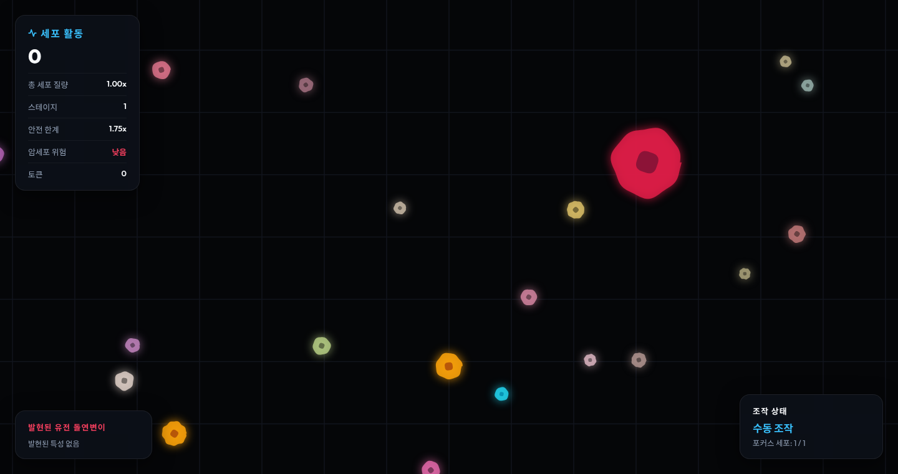

# 세포 키우기. Grow your cell

Microscopic cell-growth survival game built with Godot 4 and a playable web prototype.

[Play on GitHub Pages](https://dh-kam.github.io/grow-your-cell/)



## Overview

Grow your cell is an organic arcade survival game where the player grows, splits, recombines, and adapts inside a microscopic world. The game mixes direct control with AI instinct control, phagocytosis-style absorption effects, stage-based growth limits, cancer-cell threats, and unlockable cell types.

The current repository contains:

- A Godot 4 project for the native game.
- A standalone HTML canvas web prototype deployed through GitHub Pages.
- Planning notes under `docs/`.

## Play

The web build is deployed from `web_prototype/`:

```text
https://dh-kam.github.io/grow-your-cell/
```

To run locally:

```bash
cd web_prototype
python3 -m http.server 8000 --bind 0.0.0.0
```

Then open:

```text
http://127.0.0.1:8000/
```

## Core Features

- Stage-based growth with a hard cell-size safety limit.
- Cell rupture game over if total mass exceeds the stage limit through a bug or abnormal path.
- Manual movement and AI instinct movement mode.
- Split cells, focused cell selection, and directed recombination.
- Phagocytosis-style absorption visual effects.
- Lysosome projectiles that shrink or kill enemy cells and cancer cells.
- Cancer cells that destroy or infect other cells.
- Token rewards after stage clear.
- Store system for unlocking alternate starting cells.
- Mouse-wheel microscope zoom.
- Keyboard help panel toggle.

## Controls

| Action | Input |
| --- | --- |
| Move | `WASD` or arrow keys |
| Toggle AI instinct control | `M` |
| Focus split cell | `Tab` or click/tap a cell |
| Recombine focused cell | `R` |
| Split mitosis | `Space` |
| Dash | `Shift` |
| Shoot lysosome | `Q` |
| Spore mode | `E` |
| Cilia brake | `Ctrl` |
| Zoom | Mouse wheel |
| Toggle help panel | `H` or `F1` |

## Stage And Cancer Rules

Each stage defines a target mass that is also the safe maximum cell mass for that stage.

- Reaching the limit clears the stage and awards tokens.
- Normal growth is capped at the stage limit.
- If total player mass is detected above the limit, the cell ruptures and the game ends.
- Higher stages increase cancer-cell spawn chance and infection chance.
- If the player has one cell and touches a cancer cell, the game ends.
- If the player has multiple split cells, only the touched cell is destroyed or converted into a cancer cell.

## Store Cells

Tokens can unlock new starting cell types:

- Basic Cell: balanced starter cell.
- Cilia Agile Cell: faster movement, lower starting mass.
- Macrophage Cell: stronger lysosome damage, better cancer resistance.
- Reinforced Membrane Cell: high cancer resistance, lower mobility and acid power.

Unlocked cells and current selection are stored in browser `localStorage`.

## Godot Project

The native project uses Godot 4.3.

```bash
godot4 --path .
```

The main scene is:

```text
main.tscn
```

## GitHub Pages

Deployment is handled by:

```text
.github/workflows/deploy.yml
```

The workflow uploads `web_prototype/` as the Pages artifact.

## Documentation

- [Initial plan and direction](docs/plan-20260523-1.md)
- [Cancer cells, stages, tokens, and store plan](docs/plan-20260524-1.md)
